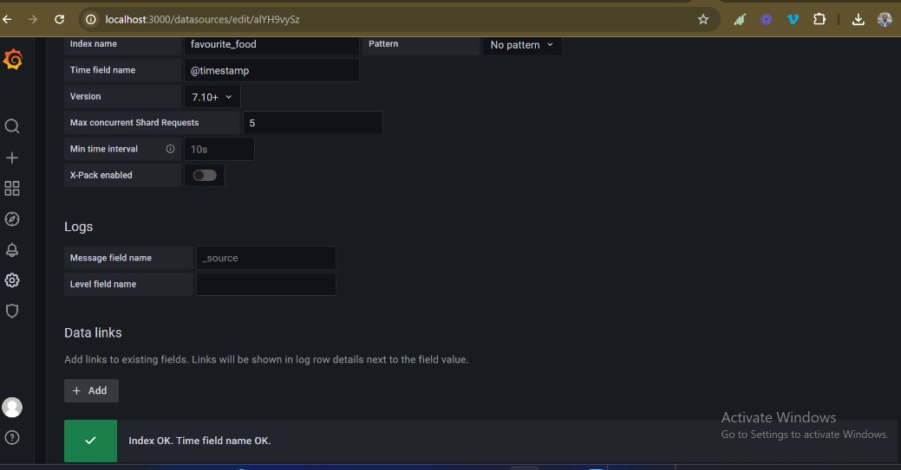

# Logging System

The Logging System is a robust solution designed to collect, store, and visualize log data. It leverages Elasticsearch as the data store for logs, Kibana for management and exploration, and Grafana for advanced visualization. This repository contains the codebase and configuration files required to set up and run the logging system.

## Key Components

### 1. Elasticsearch
Elasticsearch is a powerful, open-source search and analytics engine. In this logging system, it is used as the primary datastore for storing log data. Elasticsearch allows for efficient indexing, querying, and analysis of large volumes of log data.

### 2. Kibana
Kibana is an open-source data visualization dashboard for Elasticsearch. It allows you to explore, visualize, and manage the log data stored in Elasticsearch. Kibana provides powerful tools for creating detailed visualizations and dashboards.

### 3. Grafana
Grafana is an open-source platform for continous monitoring and observability. It provides a rich set of tools to create, explore, and share dashboards, making it easy to visualize the data stored in Elasticsearch and understand how it is working in real time. Grafana's flexible query options and interactive visualizations help in gaining deep insights from log data.
Grafana is used for continous monitoring our application.

### 4. Node.js Backend
The backend is built with Node.js and Express.js, providing APIs to ingest and manage log data. The backend communicates with Elasticsearch to index and retrieve logs.

## Features

- **Log Ingestion:** API endpoints to ingest logs into Elasticsearch.
- **Index Management:** Automatically create and manage indices in Elasticsearch.
- **Data Visualization:** Pre-configured Grafana dashboards for log visualization and analysis.
- **Timestamp Management:** Automatic addition of `@timestamp` field to log entries for precise time-based querying.

## Installation

### Prerequisites
- [Node.js and npm](https://nodejs.org/)
- [Elasticsearch](https://www.elastic.co/guide/en/elasticsearch/reference/8.13/setup.html)
- [Kibana](https://www.elastic.co/guide/en/kibana/current/install.html)
- [Grafana](https://grafana.com/docs/grafana/latest/)

### Steps

1. **Clone the Repository:**

    ```sh
    git clone https://github.com/Ogedi001/logging_system.git
    cd logging_system
    ```

2. **Install Dependencies:**

    ```sh
    npm install
    ```

3. **Environment Variables:**

    Create a `.env` file in the root of the project and add the following environment variables:

    ```env
    PORT=4000 # default port
    ELASTIC_URL=http://localhost:9200/  # Elasticsearch runs locally on port 9200 by default
    ELASTIC_USERNAME=elastic
    ELASTIC_PASSWORD=<your_password>
    ```

### Elasticsearch Setup

1. **Download and Install Elasticsearch:**

    Follow the instructions from the [Elasticsearch installation guide](https://www.elastic.co/guide/en/elasticsearch/reference/current/install-elasticsearch.html) to download and install Elasticsearch.

**N/B** Password for elasticsearch is autogenerated during installation. Copy and Save somewhere.

To see all executable program  or "Elasticsearch CLI commands"
```sh
cd /usr/share/elasticsearch/bin
ls
```
2. **To reset password**
```sh
    sudo bin/elasticsearch-reset-password
```

3. **To generate enrolement token for kibana**
 ```sh
    sudo bin/elasticsearch-create-enrollment-token --scope kibana
```

4. **Start Elasticsearch**
    ```sh
    sudo bin/elasticsearch
    ```

5. **Some Important command Linux**
```sh
systemctl start elasticsearch //start elasticsearch
systemctl status elasticsearch //see elasticsearch status
systemctl stop elasticsearch //stop elasticsearch from running
```
6. **To Adjust Elasticsearch Configuration**

Open "yml" file

```sh
sudo nano /etc/elasticsearch/elasticsearch.yml 
```
**E.g**
To configure CORS
-open "yml" with any of nano , vim etc \

Then Add
```sh
#Enable Cors for origins 
const corsOptions = {
  origin: '*', // Allow all origins
  methods: ['OPTIONS', 'POST', 'GET'],
  allowedHeaders: ['X-Requested-With', 'X-Auth-Token', 'Content-Type', 'Content-Length', 'Authorization', 'Access-Control-Allow-Headers', 'Accept'],
  credentials: true
};

app.use(cors(corsOptions));
```
7. **Check if Elasticsearch is running**
```
curl -i -u elastic:<your password> GET https://localhost:9200
```
or \
open URL on browser, enter password and username 

```plaintext
https://localhost:9200
```


### Kibana Setup

1. **Download and Install Kibana:**

    Follow the instructions from the [Kibana installation guide](https://www.elastic.co/guide/en/kibana/current/install.html) to download and install Kibana.

2. **Configure Kibana:**
   To see all executable program  or "Elasticsearch CLI commands"
   ```sh
   cd /usr/share/kibana/bin
    ls
    ```
    Open the `kibana.yml` configuration file and set the `elasticsearch.hosts` property to point to your Elasticsearch instance:
   ```sh
    sudo nano /etc/kibana/kibana.yml 
    ```
    ```yaml
    elasticsearch.hosts: ["http://localhost:9200"]
    ```
    To allow connection to every posible user
   ```yaml
    server.host: "0.0.0.0"
    ```
   Set Port 
   ```yaml
   server.port: 5601
   ```

3. **Start Kibana:**
    ```sh
    bin/kibana
    ```
4. **Some Important command Linux**

```sh
systemctl start kibana //start kibana
systemctl status kibana //see kibana status
systemctl stop kibana//stop kibana from running
```

7. **Check if Kibana is running And View Logs**

open URL on browser, enter 
```plaintext
http://localhost:5601
```
- Copy and paste elasticsearch enrollment token 
- Sign up automatically
- Login with your Elasticsearh
- Go to kibana dashboard
- Go to Stack Management
- Index Mangement 

You can select any index from the available indices to manage or discover index

### Grafana Setup

1. **Download and Install Grafana:**

    Follow the instructions from the [Grafana installation guide](https://grafana.com/docs/grafana/latest/installation/) to download and install Grafana.

2. **Start Grafana:**

    ```sh
    sudo systemctl start grafana-server
    ```

3. **Add Elasticsearch Data Source in Grafana:**

    - Open Grafana in your browser (http://localhost:3000).
    - Log in with the default credentials (admin/admin).
    - Go to **Configuration > Data Sources > Add data source**.
    - Select Elasticsearch and configure it with your Elasticsearch URL (http://localhost:9200).





- Create New Dashboard to visualized and monitor the data 

6. **Run the Application:**

   ```sh
   npm start or npm run dev
   ```

   The application will start on `http://localhost:PORT`.

## Usage

### API Endpoints

- **Endpoint:**
  - `POST http://localhost:PORT/api/log/local/:logName`
  - **Description:** Ingest log data into Elasticsearch using local configuration.
- **Endpoint:**
  - `POST http://localhost:PORT/api/log/cloud/:logName`
  - **Description:** Ingest log data into Elasticsearch running on cloud.

#### Ingest Log Data (Cloud Configuration):

- **Endpoint:** `POST http://localhost:PORT/api/log/cloud/:logName`
- **Description:** Ingest log data into Elasticsearch running on cloud.
- **URL Parameters:**
  - `logName` (string): The name of the log index.
- **Body Parameters:**
  - `logData` (object): The log data to be ingested.

**Example Request:**

```sh
curl -X POST http://localhost:PORT/api/log/cloud/example-log -H 'Content-Type: application/json' -d '{
    "message": "This is a log message",
    "level": "info"
}'
```

#### Ingest Log Data (Local Configuration):

- **Endpoint:** `POST http://localhost:PORT/api/log/local/:logName`
- **Description:** Ingest log data into Elasticsearch running on cloud.
- **URL Parameters:**
  - `logName` (string): The name of the log index.
- **Body Parameters:**
  - `logData` (object): The log data to be ingested.

**Example Request:**

```sh
curl -X POST http://localhost:PORT/api/log/local/example-log -H 'Content-Type: application/json' -d '{
    "message": "This is a log message",
    "level": "info"
}'
```

## Contributing

Contributions are welcome! Please open an issue or submit a pull request for any improvements or bug fixes.

## Contact

For any questions or inquiries, please contact ogedifavour2@gmail.com.

---

Enjoy using the Logging System!
